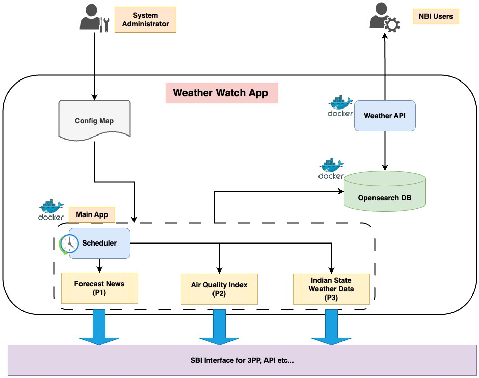

## Weather-Watch

### Overview
---

Weather-Watch is a application designed to provide access to users to retrieve weather data, air quality index (AQI) information, and weather forecast news. Built on Docker containers, it offers scalability and ease of deployment. Additionally, Weather-Watch features a Northbound API, allowing seamless consumption of data for various applications and services.

<!-- Todo explain each microservice
#### Component level description
-->

### Architecture Diagram
---

### Prerequisites
---
* docker (used for creating container images, spwan docker container etc.)

* API Key from [openweathermap](https://home.openweathermap.org/)

### Usage
---

<!--
##### Todod provide how to bring up and use the curl command and provide a video documentation
docker cli to make up

####
curl command to utlize
--> 

#### Getting Current Weather Information

To get the current weather information for a specific location, follow these steps:

<!-- 
1. **Open the Weather App**:
2. **Search for Location**: Enter the name of the location for which you want to get weather information in the search bar.
3. **View Weather Details**: Once the location is selected, the app will display the current weather information, including temperature, humidity, wind speed, and Air Quality Index (AQI).
-->

#### Viewing Air Quality Index (AQI)

The app also provides Air Quality Index (AQI) information along with weather details. AQI measures the quality of air in a particular area and its potential effects on health.

### API Endpoint
---

<!-- API Endpoint with Params as well as post method jwt token to be implemented with user login -->

| Method | Endpoint | Description |
|:-------|:---------|:------------|
| <code>GET</code> | <code>/v1/currentWeather</code> | List the current weather of India |
| <code>GET</code> | <code>/v1/historyWeather</code> | List the historical weather data |
| <code>GET</code> | <code>/v1/currentAirQualityIndex</code> | List the current AQI of India |
| <code>GET</code> | <code>/v1/historyAirQualityIndex</code> | List the historical AQI data |