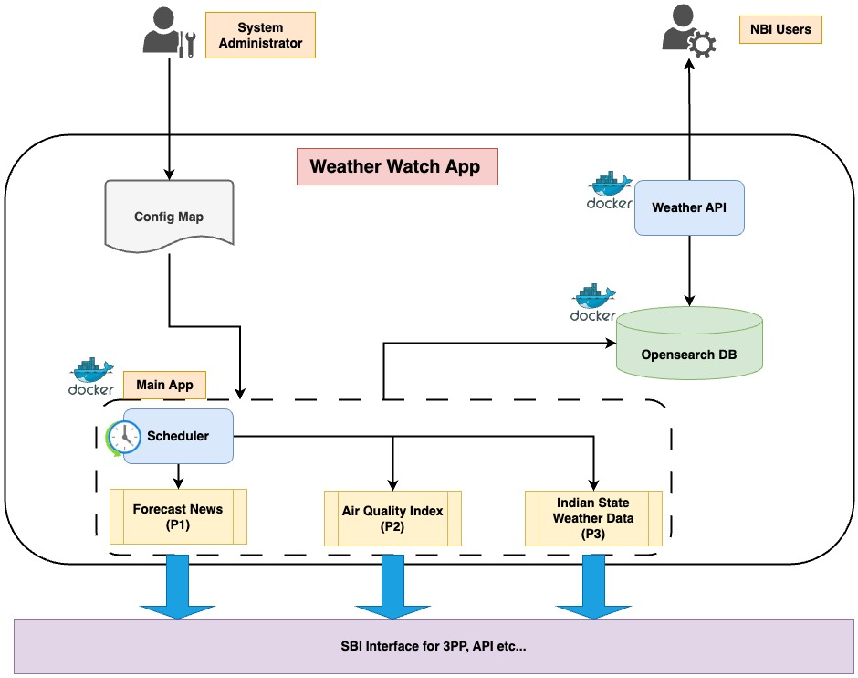

## Weather-Watch

### Overview

Weather-Watch is a application designed to provide access to users to retrieve weather data, air quality index (AQI) information, and weather forecast news. Built on Docker containers, it offers scalability and ease of deployment. Additionally, Weather-Watch features a Northbound API, allowing seamless consumption of data for various applications and services.

### Architecture Diagram



### API Specification

The Weather-Watch App utilizes the following APIs:

#### Weather API:
API endpoint used to retrieves current & historical weather data for a specified location.

**Endpoint:** `GET /v1/currentWeather`

#### Responses

- **200 OK**
  - **Content Type:** `application/json`
  - **Body:**
    ```json
     [
        {
            "location": {
            "pincode": 0,
            "taluka": "string",
            "district": "string",
            "state": "string",
            "countryCode": "string",
            "postOfficeName": "string",
            "lon": 0,
            "lat": 0
            },
            "wind": {
            "speed": 0,
            "deg": 0,
            "gust": 0
            },
            "weather": {
            "temp": 0,
            "feels_like": 0,
            "temp_min": 0,
            "temp_max": 0,
            "pressure": 0,
            "humidity": 0,
            "sea_level": 0,
            "grnd_level": 0
            },
            "weatherCode": 0,
            "description": "string",
            "epochTime": 0,
            "dt": 0,
            "timezone": 0,
            "eventTime": "2024-05-01T16:53:10.899Z"
        }
    ]
    ```

- **404 Not Found**
  - **Content Type:** `application/json`
  - **Body:**
    ```json
    {
        "code": 0,
        "message": "string"
    }
    ```

- **Air Quality API**: Retrieves Air Quality Index (AQI) data for a specified location.

## Usage

### Getting Current Weather Information

To get the current weather information for a specific location, follow these steps:

<!-- 
1. **Open the Weather App**:
2. **Search for Location**: Enter the name of the location for which you want to get weather information in the search bar.
3. **View Weather Details**: Once the location is selected, the app will display the current weather information, including temperature, humidity, wind speed, and Air Quality Index (AQI).
-->

### Viewing Air Quality Index (AQI)

The app also provides Air Quality Index (AQI) information along with weather details. AQI measures the quality of air in a particular area and its potential effects on health.