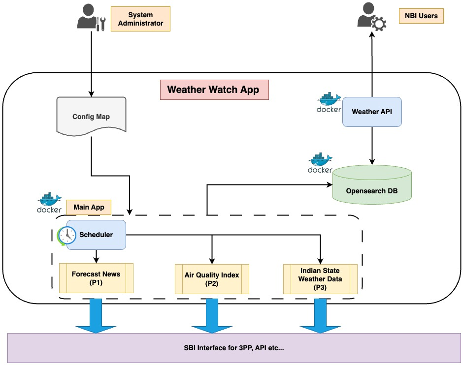

## Weather-Watch


### Overview
---

Weather-Watch is a containerized application that collects, stores and serves real-time weather data, Air Quality Index (AQI) and forecast information for Indian states and cities. It uses the [OpenWeatherMap API](https://openweathermap.org/api) as its data source, [Opensearch](https://opensearch.org/) as its data store, and exposes a RESTful Northbound API for data consumption.

##### Key Capabilities:
- **Scheduled and data collection** - Periodically fetches weather and AQI data for thousands of Indian pin codes.
- **Geo-location enrichment** - Resolves pin codes to lat/lon coordinates via the OpenWeatherMap geocoding API
- **Historical data** - Stores time-partitioned history indices for weather and AQI trends
- **Threshold alerting** - Configurable rules engine that evaluates AQI levels and temperature extremes, generating alerts stored in OpenSearch.
- **REST API** - Query current/historical weather, AQI, geo-locations, alerts and manage threshold rule files.
- **Frontend dashboard** - Single-page web UI to visualize weather, AQI, alerts and location data

### Architecture Diagram
---


### Prerequisites
---
- **Docker** and **Docker Compose** (v2+)
- **OpenWeatherMap API Key** - Sign up at [openweathermap.org](https://home.openweathermap.org/) to get a free API key
- **Java 11** (only if rebuilding the API Server from swagger specs)

## Quick Start

### 1. Clone the repository

```bash
git clone https://github.com/amolpratap-singh/Weather-Watch.git
cd Weather-Watch
```

### 2. Configure environment

Edit `docker-compose.yaml` and set your OpenWeatherMap API Key.

```yaml
environment:
  - WEATHER_API_KEY=<your-api-key-here>
```

> **Security note**: For production, use Docker secrets or a `.env' file instead of hardcoding credentials in `docker-compose.yaml`

### 3. Start the services

```bash
docker compose up -d --build
```

This starts three containers:
| Service | Container | Port | Description |
|---------|-----------|------|-------------|
| `opensearch` | opensearch-node-1 | 9200 | OpenSearch data store |
| `main-app` | main-app-server | — | Data collection scheduler |
| `api_server` | api-server | 8000 | REST API server |

### 4. Verify services are running

```bash
# Check containers
docker compose ps

# Test API server
curl http://localhost:8000/v1/currentWeather?limit=5

# Test OpenSearch
curl -k -u admin:weatherTest@123 https://localhost:9200/_cat/indices
```
### 5. Open the dashboard

Open `frontend/index.html` in your browser. The dashboard connects to `http://localhost:8000` by default — you can change the API URL in the config bar.

## API Reference

### Weather Endpoints

| Method | Endpoint | Description | Query Parameters |
|--------|----------|-------------|------------------|
| `GET` | `/v1/currentWeather` | Current weather for all locations | `pincode`, `state`, `district`, `limit`, `order`, `sort_by` |
| `GET` | `/v1/historyWeather` | Historical weather data | `pincode`, `state`, `district`, `start_time`, `end_time`, `limit` |

### Air Quality Index Endpoints

| Method | Endpoint | Description | Query Parameters |
|--------|----------|-------------|------------------|
| `GET` | `/v1/currentAirQualityIndex` | Current AQI for all locations | `pincode`, `state`, `district`, `limit`, `order`, `sort_by` |

### Geo-Location Endpoints

| Method | Endpoint | Description | Query Parameters |
|--------|----------|-------------|------------------|
| `GET` | `/v1/geo-locations` | List supported locations | `pincode`, `state`, `district`, `limit`, `order`, `sort_by` |

### Alerts Endpoints

| Method | Endpoint | Description | Query Parameters |
|--------|----------|-------------|------------------|
| `GET` | `/v1/alerts` | List threshold alerts | `severity`, `alert_type`, `limit`, `order` |

### Threshold Rule File Endpoints

| Method | Endpoint | Description |
|--------|----------|-------------|
| `GET` | `/v1/thresholdAlarmsRuleFiles` | List all rule files |
| `POST` | `/v1/thresholdAlarmsRuleFiles/{file_name}` | Upload a rule file |
| `GET` | `/v1/thresholdAlarmsRuleFiles/{file_name}` | Get a rule file |
| `PUT` | `/v1/thresholdAlarmsRuleFiles/{file_name}` | Update a rule file |
| `DELETE` | `/v1/thresholdAlarmsRuleFiles/{file_name}` | Delete a rule file |

> **Note**: Threshold rule file endpoints require `THRESHOLD_ENABLE=true` environment variable.

### Example API Calls

```bash
# Get current weather for Maharashtra
curl "http://localhost:8000/v1/currentWeather?state=Maharashtra&limit=10"

# Get AQI sorted by state
curl "http://localhost:8000/v1/currentAirQualityIndex?sort_by=state&order=0&limit=20"

# Get geo-locations for a specific pincode
curl "http://localhost:8000/v1/geo-locations?pincode=400001"

# Get critical alerts
curl "http://localhost:8000/v1/alerts?severity=critical&limit=50"
```

## Threshold Alerting System

The threshold engine evaluates collected weather and AQI data against configurable rules and generates alerts stored in the `weather-alerts` OpenSearch index.

### Configuration

Edit `config/thresholds.yaml`:

```yaml
aqi:
  alert_level: 4          # Alert when AQI >= this (1=Good, 2=Fair, 3=Moderate, 4=Poor, 5=Very Poor)

temperature:
  high_alert: 42          # Alert when temperature >= 42°C
  low_alert: 5            # Alert when temperature <= 5°C
```

Thresholds can also be set via environment variables:
- `AQI_ALERT_THRESHOLD` — AQI level that triggers alerts (default: 4)
- `TEMP_HIGH_ALERT` — High temperature threshold in °C (default: 42)
- `TEMP_LOW_ALERT` — Low temperature threshold in °C (default: 5)

### Alert Severity Levels

| Severity | Temperature | AQI |
|----------|-------------|-----|
| `critical` | ≥ 47°C or ≤ 0°C | Level 5 (Very Poor) |
| `warning` | ≥ 42°C or ≤ 5°C | Level 4 (Poor) |

### Alert Document Schema

```json
{
  "alertType": "temperature_high",
  "severity": "critical",
  "message": "High temperature alert: 48°C in Nagpur, Maharashtra",
  "location": { "pincode": 440001, "district": "Nagpur", "state": "Maharashtra" },
  "currentValue": 48,
  "threshold": 42,
  "epochTime": 1714636800,
  "eventTime": "02-05-26 08:00:00",
  "acknowledged": false
}
```

### Future Integration

The alert system is designed for future notification integration:
- Email/SMS notifications when alerts are generated
- Webhook callbacks to external systems
- Alert acknowledgment and escalation workflows

## Data Sources

Weather-Watch fetches data from the following OpenWeatherMap APIs:

| API | URL | Purpose |
|-----|-----|---------|
| Geocoding | `http://api.openweathermap.org/geo/1.0/zip` | Resolve pin codes to lat/lon |
| Current Weather | `https://api.openweathermap.org/data/2.5/weather` | Temperature, humidity, wind, conditions |
| Air Pollution | `http://api.openweathermap.org/data/2.5/air_pollution` | AQI level and pollutant components (CO, NO₂, O₃, SO₂, PM2.5, PM10) |

## OpenSearch Indices

| Index | Description | Key Fields |
|-------|-------------|------------|
| `geo-location` | Pin code to location mapping | pincode, district, state, lat, lon |
| `current-weather` | Latest weather per location | location, weather (temp, humidity), wind, description |
| `history-weather.YYYY-MM-DD-HH` | Hourly weather snapshots | Same as current-weather |
| `current-aqi` | Latest AQI per location | location, aqi, components |
| `history-aqi.YYYY-MM-DD-HH` | Hourly AQI snapshots | Same as current-aqi |
| `weather-alerts` | Threshold violation alerts | alertType, severity, message, location, value |

## Environment Variables

### main-app

| Variable | Default | Description |
|----------|---------|-------------|
| `LOG_LEVEL` | `INFO` | Logging level |
| `OPENSEARCH_HOST` | `localhost` | OpenSearch hostname |
| `OPENSEARCH_PORT` | `9200` | OpenSearch port |
| `OPENSEARCH_AUTH_USERNAME` | — | OpenSearch username |
| `OPENSEARCH_AUTH_PASSWORD` | — | OpenSearch password |
| `WEATHER_API_KEY` | — | OpenWeatherMap API key |
| `SCHEDULER_INTERVAL` | `86400` | Data collection interval in seconds (24h) |
| `PROCESS_INTERVAL` | `30` | Process interval |
| `AQI_ALERT_THRESHOLD` | `4` | AQI level that triggers alerts |
| `TEMP_HIGH_ALERT` | `42` | High temperature alert threshold (°C) |
| `TEMP_LOW_ALERT` | `5` | Low temperature alert threshold (°C) |

### api-server

| Variable | Default | Description |
|----------|---------|-------------|
| `LOG_LEVEL` | `INFO` | Logging level |
| `OPENSEARCH_HOST` | `localhost` | OpenSearch hostname |
| `OPENSEARCH_PORT` | `9200` | OpenSearch port |
| `OPENSEARCH_AUTH_USERNAME` | — | OpenSearch username |
| `OPENSEARCH_AUTH_PASSWORD` | — | OpenSearch password |
| `THRESHOLD_ENABLE` | `false` | Enable threshold rule file CRUD endpoints |
| `RULE_FILES_PATH` | `/tmp/rule_files` | Storage path for threshold rule files |

## Frontend Dashboard

The dashboard (`frontend/index.html`) is a self-contained single-page application with no build step required. It provides:

- **Weather tab** — Current temperature, humidity, wind speed, and conditions with filtering by state/pincode
- **AQI tab** — Air quality levels with pollutant breakdown (CO, NO₂, O₃, SO₂, PM2.5, PM10)
- **Alerts tab** — Threshold violation alerts with severity filtering
- **Locations tab** — All monitored geo-locations with coordinates

To use: open `frontend/index.html` in any modern browser and configure the API server URL.

## Development

### Local setup (without Docker)

```bash
# Create virtual environment
python3 -m venv weather-watch-venv
source weather-watch-venv/bin/activate

# Install main-app dependencies
pip install -r weather-main-app/requirements.txt
pip install -e weather-main-app/

# Install api-server dependencies
pip install -r api-server/requirements.txt

# Set environment variables
export OPENSEARCH_HOST=localhost
export OPENSEARCH_PORT=9200
export OPENSEARCH_AUTH_USERNAME=admin
export OPENSEARCH_AUTH_PASSWORD=<your-password>
export WEATHER_API_KEY=<your-api-key>

# Run main-app
cd weather-main-app/src && python main.py

# Run api-server (in another terminal)
cd api-server && gunicorn -b 0.0.0.0:8000 swagger_server.wsgi:app --worker-class uvicorn.workers.UvicornWorker
```

### Running tests

```bash
cd weather-main-app
python -m pytest unitest/ -v
```

### Rebuilding the API server from specs

The API server controllers are generated from OpenAPI specs using Swagger Codegen. To regenerate:

```bash
cd api-server/build_src
python build.py
```

This requires Java 11 and the Swagger Codegen CLI JAR.

## Troubleshooting

| Issue | Solution |
|-------|----------|
| API server returns empty data | Wait for main-app to complete its first data collection cycle (check logs: `docker compose logs main-app`) |
| OpenSearch connection refused | Ensure OpenSearch is healthy: `curl -k https://localhost:9200` |
| `limit > 10000` error | The API caps results at 10,000. Use pagination or filtering. |
| Threshold endpoints return 405 | Set `THRESHOLD_ENABLE=true` in the api-server environment |
| Frontend shows "Error: Failed to fetch" | Check CORS settings and ensure the API server URL is correct |

## License

This project is licensed under the Apache License 2.0 — see the [LICENSE](LICENSE) file for details.
